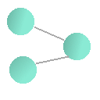

<div id="top"></div>
<br />
<div align="center">
  <a href="https://github.com/PitiRR/VisualGraphTheory">
    
  </a>

<h3 align="center">Visual Graph Theory</h3>

  <p align="center">
    Scrape currency exchange information from online bureaus around the world in real time and see if there is a possible arbitrage profit to be earned, with minimal risk. See the results in an interactive graph network.
    <br />
    <a href="https://github.com/PitiRR/VisualGraphTheory"><strong>Explore the docs »</strong></a>
    <br />
    <br />
  </p>
</div>

<details>
  <summary>Table of Contents</summary>
  <ol>
    <li>
      <a href="#about-the-project">About The Project</a>
      <ul>
        <li><a href="#built-with">Built With</a></li>
      </ul>
    </li>
    <li>
      <a href="#getting-started">Getting Started</a>
      <ul>
        <li><a href="#prerequisites">Prerequisites</a></li>
        <li><a href="#installation">Installation</a></li>
      </ul>
    </li>
    <li><a href="#usage">Usage</a></li>
    <li><a href="#roadmap">Roadmap</a></li>
    <li><a href="#contributing">Contributing</a></li>
    <li><a href="#license">License</a></li>
    <li><a href="#contact">Contact</a></li>
    <li><a href="#acknowledgments">Acknowledgments</a></li>
  </ol>
</details>


<!-- ABOUT THE PROJECT -->
## About The Project

[![main-screenshot]](http://localhost:3000/visualize)

> Arbitrage is the simultaneous purchase and sale of the same asset in different markets in order to profit from tiny differences in the asset's listed price. It exploits short-lived variations in the price of identical or similar financial instruments in different markets or in different forms.

Investopedia page for <a href="https://www.investopedia.com/terms/a/arbitrage.asp">Arbitrage </a>

The Arbitrage Visualizer (app from now on) is the program that, using graph theory, finds a negative cycle inside a graph of currencies downloaded online. It uses real-life data from online currency exchanges (including one with cryptocurrencies).

At the heart of this app is the <a href="https://en.wikipedia.org/wiki/Bellman%E2%80%93Ford_algorithm">Bellman-Ford Algorithm</a>. It is similar to the famous Dijkstra's algorithm, however B-F allows for negative values to occur in the network, often called negative weights. For this reason, it is possible to find a negative cycle. In this context, a negative cycle implies a loop that infinitely grows or shrinks - an arbitrage - an infinite and risk-free profit!

The architecture of the app is very easily maintanable and scalable. Each cantor has its own method, and it's called once in <code>app.ts</code>. What if there is an overlap? The <code>insertOrImproveEdge()</code> method in <code>graph.ts</code> takes care of that, either by updating the data or inserting it as a new vertex, also called an Edge in the code. Additionally, unique approaches can be used to gather information from different sources. Just because cheerio was used to collect information from one place, does not mean you can't introduce your own parser or use a different library.

The code itself is also written in a pretty smart way. To utilize the <var>O</var>(<var>n</var>) lookup time of a hashtable, this app uses those many times - there is even a hashtable of a hashtable present.

<p align="right">(<a href="#top">back to top</a>)</p>

### Built With

* [Typescript](https://www.typescriptlang.org/)
* [Express](https://expressjs.com/)
* [Bootstrap](https://getbootstrap.com)
* [d3js](https://d3js.org/)
* [VSC & Extensions](https://code.visualstudio.com/)
* [cheerio](https://cheerio.js.org/)
* [axios](https://axios-http.com/)
* [ejs](https://ejs.co/)

<p align="right">(<a href="#top">back to top</a>)</p>

<!-- GETTING STARTED -->
## Getting Started

To get the app installed and running, follow the next two sections and start the server:
```sh
cd VisualGraphTheory
node src/server.js
```

If the installation was successful, you should see `Listening on: `<a href="http://localhost:3000">`http://localhost:3000`</a> message.

### Prerequisites

* <a href="https://nodejs.org/en/download/">node</a>
* npm
  ```sh
  npm install npm@latest -g
  ```

### Installation

1. Clone the repo
   ```sh
   git clone https://github.com/PitiRR/VisualGraphTheory.git
   ```
2. Install NPM packages
   ```sh
   npm install
   ```

<p align="right">(<a href="#top">back to top</a>)</p>


<!-- USAGE EXAMPLES -->
## Usage

See [Getting Started](#getting-started) section to learn how to start the server.

Inside the app, you will be able to access between different pages using the navbar at the top.
[![navbar]](http://localhost:3000/)

Note that all information in About and Contact pages are available in this document.

To run the visualization, go to <code>Start!</code> page.

Upon a successful completion, the visualization page will be divided into two parts - the graph network and data tables.

[![main-screenshot]](http://localhost:3000/visualize)

The graph section will show appear first. If a negative cycle exists, you will be able to see it with highlighted links being shown as red.

[![table]](http://localhost:3000/visualize)

Above is a sample table of links between nodes. There can be two to three tables - nodes, links and negative cycle path, respectively.

<p align="right">(<a href="#top">back to top</a>)</p>

<!-- CONTACT -->
## Contact

Piotr Wojciechowski - 
 - piotr.wojciechowski.2019@mumail.com

Project Link: [https://github.com/PitiRR/VisualGraphTheory](https://github.com/PitiRR/VisualGraphTheory)

<p align="right">(<a href="#top">back to top</a>)</p>

<!-- MARKDOWN LINKS & IMAGES -->
<!-- https://www.markdownguide.org/basic-syntax/#reference-style-links -->
[contributors-shield]: https://img.shields.io/github/contributors/PitiRR/VisualGraphTheory.svg?style=for-the-badge
[contributors-url]: https://github.com/PitiRR/VisualGraphTheory/graphs/contributors
[forks-shield]: https://img.shields.io/github/forks/PitiRR/VisualGraphTheory.svg?style=for-the-badge
[forks-url]: https://github.com/PitiRR/VisualGraphTheory/network/members
[stars-shield]: https://img.shields.io/github/stars/PitiRR/VisualGraphTheory.svg?style=for-the-badge
[stars-url]: https://github.com/PitiRR/VisualGraphTheory/stargazers
[issues-shield]: https://img.shields.io/github/issues/PitiRR/VisualGraphTheory.svg?style=for-the-badge
[issues-url]: https://github.com/PitiRR/VisualGraphTheory/issues
[license-shield]: https://img.shields.io/github/license/PitiRR/VisualGraphTheory.svg?style=for-the-badge
[license-url]: https://github.com/PitiRR/VisualGraphTheory/blob/master/LICENSE.txt
[linkedin-shield]: https://img.shields.io/badge/-LinkedIn-black.svg?style=for-the-badge&logo=linkedin&colorB=555
[linkedin-url]: https://linkedin.com/in/piotr-jan-wojciechowski/
[main-screenshot]: images/screenshot.png
[navbar]: images/navbar.png
[table]: images/sample-table.png